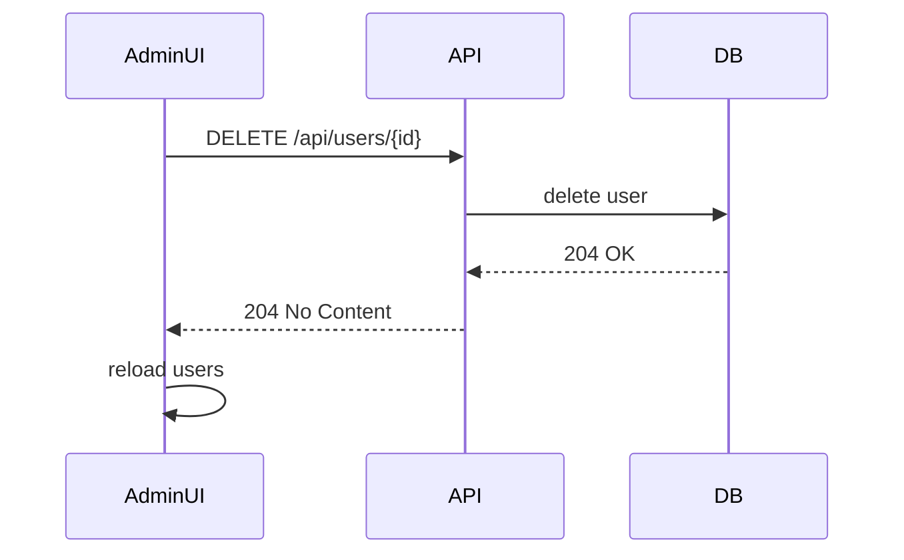

# Documentación: Módulo Admin

Resumen: descripción del área de administración del proyecto, APIs backend, rutas y componentes frontend, modelos de datos y flujos operativos (gestión de usuarios, gestión de talleres y buzón de contacto).

## Propósito

- Proveer herramientas administrativas para gestionar cuentas, talleres y comunicaciones desde una interfaz protegida para roles `ADMIN`.

## Estructura del frontend

- Dashboard: `frontend/src/app/admin/admin.component.*` — acceso rápido a submódulos.
- Gestión Usuarios: `frontend/src/app/admin/admin-gestionusuarios/*` — lista, filtros, eliminación.
- Gestión Talleres: `frontend/src/app/admin/admin-gestiontaller/*` — solicitudes, aprobaciones, talleres activos.
- Buzón de contacto: `frontend/src/app/admin/admin-contacto/*` — listar mensajes y responder.

### Rutas relevantes

- `/admin` → AdminComponent (dashboard) — `canActivate: [adminGuard]`.
- `/admin/usuarios` → AdminGestionUsuariosComponent (lazy-loaded) — `canActivate: [adminGuard]`.
- `/admin/gestiontaller` → AdminGestionTallerComponent (lazy-loaded) — `canActivate: [adminGuard]`.
- `/admin/contacto` → AdminContactoComponent (lazy-loaded) — `canActivate: [adminGuard]`.

### Patrón de componentes

- Standalone components con `imports: [...]` (CommonModule, FormsModule, RouterLink, etc.).
- Uso de `signals`/`computed` para estado local (ej.: `users`, `loading`, `error`).
- Operaciones principales expuestas en TS: `loadUsers()`, `deleteUser()`, `loadPending()`, `approve()`, `reject()`, `loadWorkshops()`, `reply()`.

## Backend (API)

Las rutas están protegidas por autenticación y autorización; solo usuarios con rol `ADMIN` deben poder ejecutar estos endpoints.

### Usuarios

- GET `/api/users` — listar usuarios
  - Query: opcional `role=USER|TALLER|ADMIN`, `q=texto` (busqueda)
  - Response 200: JSON[] de usuarios
- DELETE `/api/users/{id}` — eliminar cuenta
  - Auth: ADMIN
  - Response 204 No Content

Ejemplo (curl):

```bash
curl -H "Authorization: Bearer $TOKEN" \
  -X DELETE https://api.example.com/api/users/123
```

### Talleres y Solicitudes

- GET `/api/workshops` — lista de talleres (activos)
- GET `/api/workshop-applications/pending` — solicitudes pendientes
- POST `/api/workshop-applications/{id}/approve` — aprobar solicitud
- POST `/api/workshop-applications/{id}/reject` — rechazar solicitud
- DELETE `/api/workshops/{id}` — eliminar taller

Response: estandar JSON con entidad o mensaje; códigos 200/204/404 según caso.

### Buzón de contacto

- GET `/api/contact/messages` — listar mensajes
- POST `/api/contact/messages/{id}/reply` — enviar respuesta desde admin

Payload reply:

```json
{ "message": "Gracias por contactarnos. ..." }
```

## Modelos principales (resumen)

- User

  - id: number
  - fullName: string
  - email: string
  - role: 'USER' | 'TALLER' | 'ADMIN'
  - city?: string
  - postalCode?: string
  - createdAt: string (ISO)
- Workshop

  - id: number
  - name: string
  - mechanicName: string
  - address, phone, schedule
  - vehicleLimit: number
  - activeVehicles: number
- WorkshopApplication

  - id, workshopName, fullName, email, address, phone, schedule, vehicleLimit
- ContactMessage

  - id, name, email, phone?, message, repliedAt?, replyMessage?

## Flujo UI → API (ejemplos)

- Eliminar usuario (frontend):
  1. AdminGestionUsuariosComponent muestra lista (`loadUsers()` llama `UserApiService.listUsers()`).

2. Usuario hace click en `Eliminar`.
3. Se pide confirmación por `window.confirm` y luego `userApi.deleteAccount(user.id)`.
4. Backend responde 204 → componente recarga lista (`loadUsers()`) y muestra toast/error.

Mermaid sequence diagram:



- Aprobar solicitud taller:
  1. AdminGestionTallerComponent carga `listPending()` y `listWorkshops()`.

2. Admin pulsa `Aceptar` en solicitud → `applicationService.approve(id)`.
3. Backend crea/activa taller, borra o marca solicitud, devuelve 200 → frontend recarga datos.
