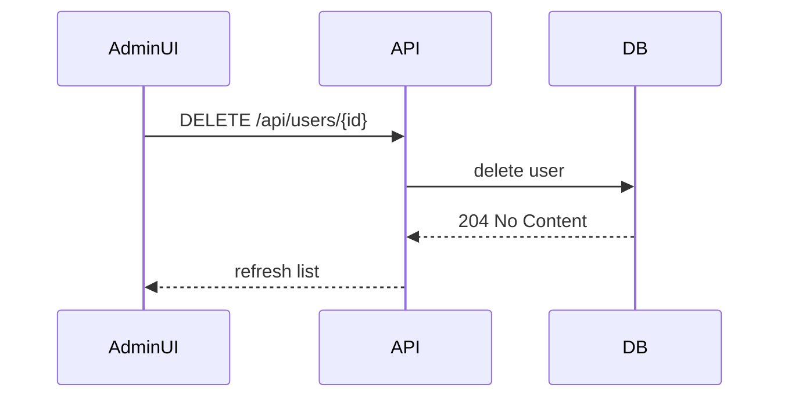

# Módulo Admin

Resumen del área de administración del proyecto: dashboard, gestión de usuarios, gestión de talleres y buzón de contacto.

## Propósito

- Proveer herramientas administrativas para gestionar cuentas, talleres y comunicaciones desde una interfaz protegida para el rol `ADMIN`.

## Estructura del frontend

- Dashboard: `frontend/src/app/admin/admin.component.*`
- Gestión de usuarios: `frontend/src/app/admin/admin-gestionusuarios/*`
- Gestión de talleres: `frontend/src/app/admin/admin-gestiontaller/*`
- Buzón de contacto: `frontend/src/app/admin/admin-contacto/*`

## Rutas relevantes

- `/admin` → `AdminComponent`
- `/admin/usuarios` → `AdminGestionUsuariosComponent`
- `/admin/gestiontaller` → `AdminGestionTallerComponent`
- `/admin/contacto` → `AdminContactoComponent`

Todas las rutas están protegidas por `adminGuard`.

## Comportamiento del frontend

- Los componentes son standalone.
- La gestión de usuarios usa `signals` y `computed` para búsqueda y filtros por rol.
- La gestión de contacto usa un modal de respuesta.
- La gestión de talleres muestra solicitudes pendientes, talleres aprobados y acciones de borrado.

## Backend real asociado

### Usuarios

- `GET /api/users`
- `GET /api/users/{id}`
- `PUT /api/users/{id}`
- `PUT /api/users/{id}/password`
- `POST /api/users/{id}/avatar`
- `DELETE /api/users/{id}`
- `PUT /api/users/{id}/role`

### Talleres y solicitudes

- `GET /api/workshops`
- `GET /api/workshop-applications/pending`
- `POST /api/workshop-applications/{applicationId}/approve`
- `POST /api/workshop-applications/{applicationId}/reject`
- `DELETE /api/workshop-applications/workshops/{workshopId}`

### Contacto

- `POST /api/contact`
- `GET /api/admin/contact`
- `POST /api/admin/contact/{id}/reply`

## Modelos principales

- `AuthUserResponseDTO`
- `WorkshopApplicationResponseDTO`
- `WorkshopDTO`
- `ContactMessageDTO`

## Flujo UI → API

### Eliminar usuario

1. `AdminGestionUsuariosComponent` carga la lista con `UserApiService.listUsers()`.
2. El admin confirma el borrado.
3. El frontend llama a `UserApiService.deleteAccount(user.id)`.
4. El backend responde `204 No Content` y el componente recarga la lista.

### Gestionar talleres

1. `AdminGestionTallerComponent` carga solicitudes pendientes y talleres.
2. El admin aprueba o rechaza la solicitud.
3. El backend crea o actualiza el taller según el estado.

### Responder contacto

1. `AdminContactoComponent` lista mensajes con `ContactApiService.listMessages()`.
2. El admin abre el modal de respuesta.
3. El frontend llama a `ContactApiService.reply(id, { message })`.

