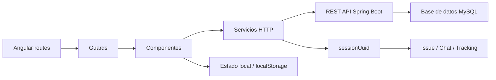

# Flujo frontend/backend

Este documento explica cómo se conectan las pantallas de Angular con los endpoints REST del backend en los recorridos principales de la aplicación.

Para ver el detalle de rutas, consulta [documentacion/api/api-tracking.md](api/api-tracking.md) y para ver las entidades, [documentacion/modelos-datos.md](modelos-datos.md).

---

## 1. Arranque de la aplicación

### Frontend

La aplicación Angular se configura desde `app.config.ts` y registra:

- `provideRouter(routes)`
- `provideHttpClient(withFetch())`
- listeners globales de errores

### Navegación inicial

La ruta raíz redirige a `login`.

```txt
/ -> /login
```

### Guards principales

- `authGuard`: protege las vistas que requieren sesión activa.
- `seguimientoGuard`: protege el acceso a seguimientos y chat.
- `adminGuard`: protege el panel de administración.

---

## 2. Autenticación y sesión

### Pantalla

- `/login`
- `/registro`

Ambas rutas usan el mismo componente y alternan entre inicio de sesión y alta.

### Backend

- `POST /api/auth/login`
- `POST /api/auth/register`

### Flujo

1. El usuario envía email y contraseña, o los datos de registro.
2. El backend valida la petición y devuelve `AuthUserResponseDTO`.
3. El frontend guarda la sesión en `localStorage`.
4. El header y los guards leen el estado compartido para decidir navegación y permisos.

### Resultado

- un `USER` accede a la zona cliente
- un `TALLER` accede a mecánico y seguimiento
- un `ADMIN` ve el panel y el menú de gestión

---

## 3. Flujo de cliente normal

### Inicio y catálogo

Pantallas principales:

- `/home`
- `/diagnostico`
- `/taller`
- `/mis-vehiculos`
- `/perfil/*`

### Backend más usado

- `GET /api/vehicles/brands`
- `GET /api/vehicles/brands/{brand}/models`
- `GET /api/vehicles/{vehicleId}/variants`
- `GET /api/personal-vehicles`
- `POST /api/personal-vehicles`
- `DELETE /api/personal-vehicles/{id}`
- `GET /api/workshops`
- `GET /api/workshops/{workshopId}`
- `POST /api/workshops/{workshopId}/select`

### Flujo resumido

1. El usuario entra en `home` o `diagnostico`.
2. Escoge vehículo o crea uno propio en `mis-vehiculos`.
3. Consulta talleres disponibles.
4. Selecciona un taller y genera seguimiento.
5. El frontend navega a `usuario/seguimiento` para ver el caso y el chat.

---

## 4. Autodiagnóstico e issue

### Pantalla

- `/diagnostico`

### Backend

- `POST /api/autodiagnosis/diagnose`
- `POST /api/issues`

### Flujo

1. El usuario rellena síntomas, texto libre y datos del vehículo.
2. El frontend envía el payload a autodiagnóstico.
3. El backend responde con diagnóstico, confianza, explicación y piezas sugeridas.
4. Si el flujo debe persistirse, se crea un `Issue` con `sessionUuid`.
5. Ese `sessionUuid` pasa a ser la clave del seguimiento y del chat.

### Resultado funcional

- el diagnóstico vive en backend
- la conversación y el progreso del caso se conectan a través de `sessionUuid`

---

## 5. Seguimiento del cliente

### Pantalla

- `/usuario/seguimiento`
- `/usuario/seguimiento/detalle`
- `/usuario/seguimiento/chat`

### Backend

- `GET /api/mechanic/client/{clientId}/trackings`
- `GET /api/mechanic/tracking/{sessionUuid}`
- `GET /api/chat/mensajes`
- `GET /api/chat/unread`
- `POST /api/chat/mark-read`
- `POST /api/chat/join`
- `POST /api/chat/leave`

### Flujo

1. El cliente abre su lista de seguimientos.
2. El frontend obtiene el `sessionUuid` del seguimiento activo.
3. Entra en el detalle y en el chat usando ese UUID.
4. El chat carga mensajes históricos y mensajes nuevos por polling.
5. Cuando el usuario entra a la sala, el frontend hace `join` para registrar presencia.

### Nota importante

El cliente no trabaja con `clientId` para escribir cambios de seguimiento; el identificador funcional es `sessionUuid`.

---

## 6. Flujo del mecánico

### Pantallas

- `/mecanico`
- `/mecanico/seguimiento`
- `/mecanico/seguimiento/chat`
- `/perfil/informacion`
- `/perfil/seguridad`
- `/perfil/vehiculo`
- `/perfil/preferencias`

### Backend

- `GET /api/mechanic/{mechanicId}/clients`
- `GET /api/mechanic/client/{clientId}/trackings`
- `GET /api/mechanic/tracking/{sessionUuid}`
- `POST /api/mechanic/{mechanicId}/tracking/{sessionUuid}/status`
- `POST /api/mechanic/{mechanicId}/tracking/{sessionUuid}/tracking-update`
- `POST /api/chat/join`
- `POST /api/chat/mensajes`

### Flujo

1. El mecánico entra en su lista de clientes.
2. Abre un caso concreto.
3. El frontend resuelve el `sessionUuid` y entra al detalle/chat.
4. Antes de enviar mensajes, el chat asegura la presencia en la sala.
5. El mecánico actualiza estado o mensaje del seguimiento usando el UUID, no el cliente.

### Resultado funcional

- el mecánico ve varios seguimientos por cliente si existen
- el estado del caso se actualiza sin depender del login
- el chat sigue la misma sesión en todo momento

---

## 7. Alta de taller

### Pantalla

- `/cambiar-rol`
- `/registro-taller`

### Backend

- `PUT /api/users/{id}/role`
- `POST /api/workshop-applications`
- `GET /api/workshop-applications/pending`
- `POST /api/workshop-applications/{applicationId}/approve`
- `POST /api/workshop-applications/{applicationId}/reject`
- `DELETE /api/workshop-applications/workshops/{workshopId}`

### Flujo

1. El usuario normal puede convertirse a `TALLER` desde la pantalla de cambio de rol.
2. Después rellena el formulario de solicitud de taller.
3. El backend guarda la solicitud como `PENDING`.
4. El administrador revisa las solicitudes desde el panel.
5. Al aprobar, se crea el taller definitivo y se asocia al mecánico.

### Resultado funcional

- la solicitud es temporal
- el taller real se crea solo cuando el admin aprueba
- el frontend de admin refleja pendientes, talleres y acciones de borrado

---

## 8. Administración

### Pantallas

- `/admin`
- `/admin/usuarios`
- `/admin/gestiontaller`
- `/admin/contacto`

### Backend

- `GET /api/users`
- `GET /api/users/{id}`
- `PUT /api/users/{id}`
- `DELETE /api/users/{id}`
- `PUT /api/users/{id}/role`
- `GET /api/admin/contact`
- `POST /api/admin/contact/{id}/reply`
- `GET /api/workshop-applications/pending`
- `POST /api/workshop-applications/{applicationId}/approve`
- `POST /api/workshop-applications/{applicationId}/reject`
- `DELETE /api/workshop-applications/workshops/{workshopId}`

### Flujo

1. El admin entra al dashboard.
2. Gestiona usuarios, talleres y buzón desde pantallas separadas.
3. El header global muestra accesos directos a las secciones admin.
4. Cada acción se traduce en una llamada REST concreta y el frontend refresca su estado local.

---

## 9. Contacto y mensajes

### Pantallas

- `/contacto`
- `/admin/contacto`

### Backend

- `POST /api/contact`
- `GET /api/admin/contact`
- `POST /api/admin/contact/{id}/reply`

### Flujo

1. El usuario envía un mensaje desde contacto.
2. El backend lo almacena como `ContactMessage`.
3. El admin lo revisa en el buzón.
4. Si procede, responde desde la misma pantalla.

---

## 10. Relación entre frontend y backend



---

## 11. Puntos críticos del diseño

- `sessionUuid` conecta issue, tracking y chat.
- El frontend no debe asumir que `clientId` sirve para escribir cambios de seguimiento.
- Los guards son la primera barrera de navegación, pero la seguridad real debe seguir estando en backend.
- El panel admin y el header comparten rutas y accesos, así que el estado de sesión debe mantenerse sincronizado.

---

## 12. Documentos relacionados

- [API del backend](api/api-tracking.md)
- [Modelo de datos](modelos-datos.md)
- [Seguimientos: sessionUuid y cambios recientes](logica/seguimiento-sessionUuid.md)
- [Sistema Mecánico ↔ Cliente](logica/mecanico-user-flow.md)
- [Flujo de creación de taller](flujo-creacion-taller.md)
